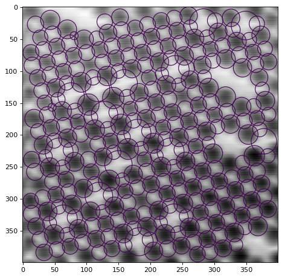
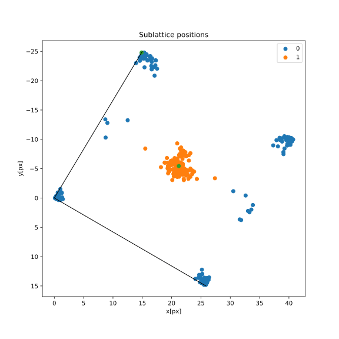

# LYRE: *L*attice s*Y*mmetry *RE*cognition 

LYRE is a tool which aims to inspect and classify atomically-resolved images (like AFM and STM) via Scale Invariant Feature Transform [(SIFT)](https://link.springer.com/article/10.1023/B:VISI.0000029664.99615.94) + Clustering Algorithms, inspired by the work of [Laanait et al](https://ascimaging.springeropen.com/articles/10.1186/s40679-016-0028-8). <br>
The main advantage of LYRE is that it exploits unsupervised machine learning techniques, so it doesn't require any image database for training, which is a bottleneck for many image classification programs. It can be executed by office computers/laptops with an overall calculation time of approximately 30-60 seconds.  No programming skills are required to use this tool, only the istructions written in the [Usage](#usage) section need to be followed.

## Installation
No installation is needed, the user just needs to download this repository. 
### Dependencies
* NumPy
* Matplotlib
* SciPy
* Scikit-learn (sklearn)
* Python Image Library (PIL)


## Usage
### General setup
In order to start the lattice recognition process, image and simulation parameters need to be set. This can be done in the following way:
* Create a folder where image, parameters file and results will be stored. In this repository, such folders are inside the [experiments](https://github.com/MarcoCrr/Lattice-symmetry-recognition/tree/master/experiments) folder;
* Specify the path and the image name at the beginning of the IPython notebook [lattice_extraction.ipynb](https://github.com/MarcoCrr/Lattice-symmetry-recognition/blob/master/lattice_extraction.ipynb). For example, the third cell of the notebook reads: <br>
```
# Insert path + filename here:
path = "experiments/small SrTiO3_1244/"
filename = "small SrTiO3_1244.png"
```
### Parameters file setup
The parameters file, *parameters.ini* is the file which contains all the parameters needed to run the simulation. It must be put inside the image folder, but if not provided some default parameters will be set; such parameters are found at the beginning of the IPython Notebook file. This section will describe the meaning of each parameter; suggestions regarding the parameters tuning are inserted in the Notebook at appropriate locations.

[*SIFT*] <br>
Three fundamental parameters of the SIFT algorithm, well explained in the [original article](https://link.springer.com/article/10.1023/B:VISI.0000029664.99615.94) by Lowe and in [this link](https://docs.opencv.org/4.5.4/d7/d60/classcv_1_1SIFT.html).
- **contrast_threshold**: the contrast threshold used to filter out weak features. Higher threshold means more discarded features. *Default: 0.003*;
- **sigma**: the sigma of the Gaussian applied to the input image at the first octave. *Default: 4*;
- **noctavelayers**: the number of layers in each octave. The number of octaves is computed automatically from the image resolution. *Default: 8*.

[*Keypoint filtering*] <br>
These are thresholds to filter out [keypoints](https://paperswithcode.com/task/keypoint-detection) ("kp") that could cause issues in the lattice identification process, in units of the median keypoint size.
- **size_threshold**: if kp_size > median*size_threshold or kp_size < median/size_threshold the keypoint is deleted. *Default: 2*;
- **edge_threshold**: all keypoints that are closer than median\*edge_threshold to one border of the image are deleted. *Default: 1*.

[*Keypoint Clustering*] <br>
Clusterings with *n* clusters between lower and upper bound are evaluated with respect to their [silhouette score](https://towardsdatascience.com/silhouette-coefficient-validating-clustering-techniques-e976bb81d10c); the one with the maximal silhouette score is chosen for further processing.
- **clustering_span_kp**: interval containing the optimal number of different clusters found in the image, evaluated by calculating the silhouette score. *Default: interval from 2 to 14*.

[*Nearest Neighbours*] <br>
Parameters related to the clustering processes used to find the primitive vectors.
- **k1**: the number of nearest neighbors considered for each keypoint. For each keypoint, the *k1* shortest distances will be taken into account. *Default: 6*;
- **cluster_span_kNN**: interval containing the optimal number of nearest neighbors, evaluated by calculating the silhouette score. *Default: interval from k1 to 4\*k1*. 
- **clustersize_Threshold**: used to reduce impact of erroneous nn-vectors on the selection of the lattice vectors. In the final distribution only nn-clusters with population ≥ clustersize_threshold\*n_max are considered; n_max here is the population of the largest cluster; *Default: 0.3*.

[*Sublattice lookup*] <br>
Once the primitive vectors have been found, we look for the sublattice positions. K-means clustering algorithm is used.
- **clustering_span_SUBL**: interval containing the optimal number of sublattice positions. *Default: interval from 2 to 10*.

[*Deviation plot*] <br>
Parameters related to the perfect-lattice-deviations plot. RIVEDI QUESTA PARTE
- **k2**: number of nearest neighbors considered for each keypoint. *Default: 10*;
- **rtol_rel**: all vectors that are within the relative_r-tolerance of the lattice vectors are drawn; *Default: 4*.
- **arrow_width**: the arrow_width can be specified (see [matplotlib.quiver() - width parameter](https://matplotlib.org/stable/api/_as_gen/matplotlib.pyplot.quiver.html)). *Default: 0.003*.


## Example
SrTiO*<sub>3* (001) with Sr vacancies, calculated with the default parameters written above: <br>
Keypoints localization after cleaning: <br>

<br> Nearest neighbours distances folded into the unit cell: <br>

<br> Arrows connecting Sr atoms, with colours based on their deviation from the primitive vector: <br>

<br> Final prediction of the cell symmetry: <br>


